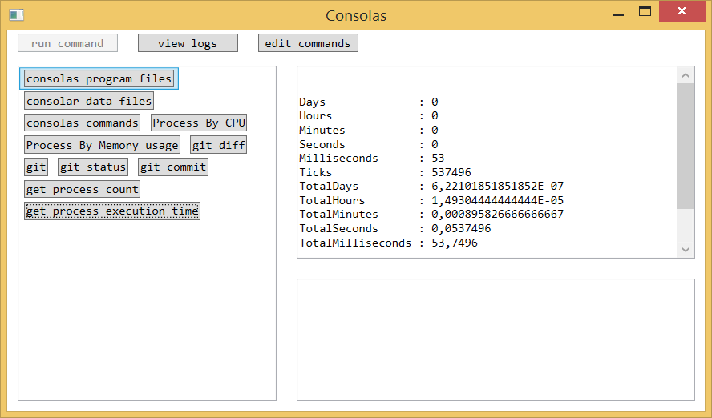
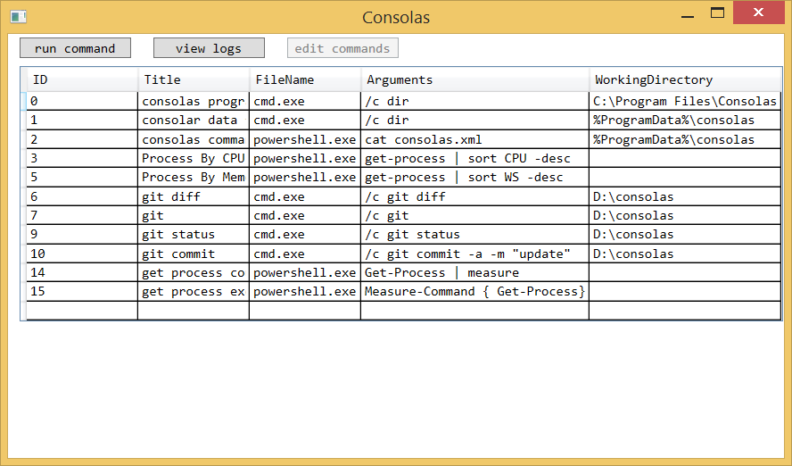

# Features that implemented

* Run Commands
* View Logs
* Creating\Editing\Deleting the commands





# Install

1. Start powershell with administrator privilegies. This need for creating a folder under 'Program Files'.

```powershell
git clone https://github.com/mbasiuk/consolas.git
cd .\consolas
.\install.ps1 -Rebuild -CreateShortcut 
```

2. This will create 2 folder C:\Program Files\Consolar with bin files,
and C:\ProgramData\Consolar for data;

2. click Consolar shortcut on the desktop.

# Update
```powershell
git pull
.\install.ps1 -Rebuild 
```


# Uninstall
 ```powershell
.\unistall.ps1
cd..
ri .\consolas -recurse -force
 ```

# Install Help
```powershell
git clone https://github.com/mbasiuk/consolas.git
cd .\consolas
man .\install.ps1 -Full
```
